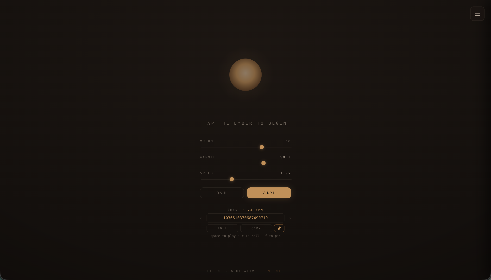
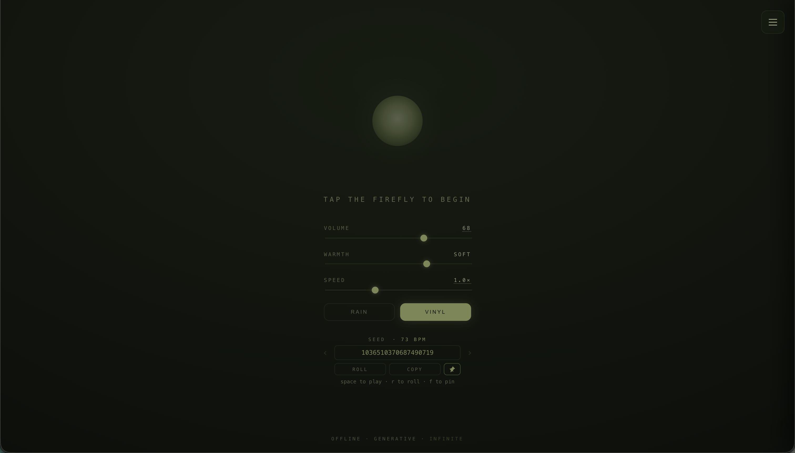
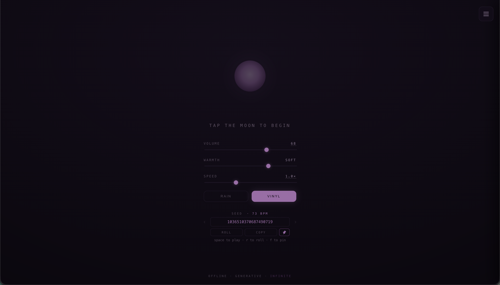

# Loam

> Loam is a free, in-browser app that plays endless, never-repeating
> lo-fi for focus. Runs entirely on your device — offline-capable, no
> accounts, no streaming, no ads.

<table>
  <tr>
    <td width="50%"> ember</td>
    <td width="50%"> forest</td>
  </tr>
  <tr>
    <td width="50%"> tide</td>
    <td width="50%"> dusk</td>
  </tr>
</table>

## Try Loam

**→ <a href="https://liami16.github.io/loam/" target="_blank" rel="noopener noreferrer">liami16.github.io/loam</a>**

Loads in any modern browser. Tap the glowing orb (the "ember") to
start. **Works offline after your first visit** — open the URL again
later with no internet and it still plays.

Optional: most browsers will offer an "Install" option that gives Loam
its own dock or home-screen icon. (See Quick Tour for per-platform
steps.)

> 🚧 **Coming soon — an Obsidian plugin.** The same engine, playing
> endless focus lo-fi right inside your notes. In progress; ⭐ watch/star
> the repo to hear when it lands.

## What is this?

Loam grows endlessly from a seed — a short number that deterministically
generates an entire endless track. Change the number, get a different
track forever. Every seed has its own personality — tempo, chord
vocabulary, melody character, swing feel, even its own way of evolving
over hours. The same seed always produces the same music, so you can
pin the ones you like and come back to them.

It's tuned to stay in the background where focus music belongs:
unobtrusive, slow-evolving, no drops or hooks competing for your
attention.

## Why you might like it

- **Built for focus, not entertainment.** Stays in the background; the
  brain habituates and the music recedes.
- **Truly offline.** Runs entirely in your browser, on your device.
  Once it's cached, it works on planes, in basements, with the wifi
  off, forever. No service to disappear on you.
- **Private by default.** No accounts, no analytics, no telemetry, no
  network calls during playback. The page is just static files.
- **Infinite & shareable.** Every seed is a different infinite
  soundscape; the seed is a number, so sharing one is sharing a URL.
  Pin the ones you like into folders.
- **Lightweight.** The whole engine is a few hundred kilobytes.
  Kilobytes, not gigabytes. No streaming bandwidth.

## Quick tour

Once you've loaded the site:

- **Tap the ember** (or hit Space) to start. Tap again to pause.
- **Press R** to reroll for a new seed; **type a number** into the
  seed input for a specific one.
- **Press F** to pin the current seed to favorites. Press **[ / ]** to
  cycle through pinned seeds.
- **Press M** to open the drawer — pinned-seed folders (with
  drag-and-drop reorder), themes (ember / forest / tide / dusk),
  rain & vinyl crackle toggles, volume / warmth / speed sliders.
- **Install it** — most browsers offer an "Install App" option that
  drops Loam into your dock or home screen as a standalone window.

## Why I built this

I tried to read a paper on a long flight and realized I hadn't
downloaded any music. The Spotify cache I had was three albums I'd
looped for weeks — already too familiar to fade.

Pre-downloading for trips works in theory, but you have to remember,
your storage fills up, and even good albums go stale on a long enough
session. Loam is what I wanted that day: loads once, plays endlessly
on-device, each seed distinct enough that the brain doesn't
pattern-match the way a track on repeat eventually does. Open source
because if I'm leaving it on for hours, I want to know what it's doing.

Made by Liam.

---

## For contributors

### Generation architecture

Deterministic, seed-based procedural generation (Minecraft-style: a seed
→ an infinite, reproducible, shareable soundscape; tiny storage; vast
combinatorial variety).

- **Primary primitives:** a seeded PRNG + coherent noise (Perlin /
  simplex, and fBm = layered noise octaves) — the Minecraft worldgen
  toolkit. Smooth, seedable, controllable, multi-scale.
- **Engine core/adapter split.** `@loam/core` is pure logic, no audio
  dependency — it emits abstract events (`note`, `param`, `tick`). The
  thin Tone.js adapter is the only layer bound to Web Audio. The split
  means the core is testable in Node, portable if the audio library is
  ever swapped, and reusable for offline analysis.
- **Target statistic:** parameter streams shaped toward a **1/f (pink)
  spectrum**. Voss & Clarke (1970s) showed 1/f sequences read as more
  "musical" than white (too random) or brown (too dull); fBm naturally
  approximates 1/f.
- **Anti-boredom = dimensionality.** With ML deliberately deferred,
  freshness over hours-long sessions comes from a wide, orthogonal
  modulation space — many per-seed parameters, each with their own
  fBm drift. See [`docs/seed-identity.md`](docs/seed-identity.md).

### Design philosophy

The principles that shape every decision:

- **Use case is sustained focus.** This inverts normal music goals.
  Predictability is a feature.
- **Cardinal rule: never *grab* attention.** No drops, no fills, no
  melodic hooks, no structural "moments." Default state is habituation
  — the brain should tune the music out. Bar to clear is "unobtrusive
  and warm," not "impressive."
- **Subtle ornaments allowed, sparingly** — a momentarily-held 9th, a
  single bell tone, a one-bar modal-mixture color. Small enough not to
  surface in deep focus, rare enough never to form a hook. See
  [`docs/ornaments.md`](docs/ornaments.md).
- **Evolve slowly and event-lessly.** Slow continuous movement is the
  default; discrete ornaments are the rare exception.
- **Part of the job is masking** irregular environmental noise (chatter,
  HVAC, traffic). It's an acoustic blanket, not a composition.
- **Pure synthesis.** Lo-fi character is produced procedurally
  (saturation, filtering, noise beds, wow/flutter), not sampled. Keeps
  the "kilobytes-not-gigabytes" identity honest.
- **Dynamics propose, music theory disposes.** Chaotic / noise sources
  drive *parameters* (filter cutoff, density, voicing); pitch is always
  quantized onto a locked scale. No wrong notes by construction.
- **Seed-determinism is a feature.** Same seed → same soundscape. The
  seed IS the song's identity (BPM, melody character, chord vocabulary,
  swing feel); user-facing knobs are limited to playback-level controls
  (volume, warmth, speed multiplier).

### Repo layout

- **`packages/core`** — `@loam/core`, the framework-agnostic engine.
  Seeded PRNG, fBm dynamics, Markov chord progressions with greedy
  voice-leading, germ-driven melody, bass with stickiness, drum
  scheduler with humanization, vinyl crackle. No audio-library
  dependency.
- **`packages/synth-tone`** — Tone.js synthesis adapter. The only layer
  bound to Web Audio.
- **`apps/web-demo`** — the hosted PWA at
  [liami16.github.io/loam](https://liami16.github.io/loam/). Bundles
  the lofi audio chain on top of the core engine.
- **`docs/`** — design docs and audit trail.
- **`archive/`** — historical artifacts (v0 prototype, etc.), kept for
  reference, not maintained.

### v1 scope

Shipped:
- The framework-agnostic core engine (`@loam/core`).
- The hosted web demo at
  [liami16.github.io/loam](https://liami16.github.io/loam/).

Planned for v1:
- An Obsidian plugin — the validation beachhead beyond browser
  playback. *In progress.*

Out of scope (v1):
- Not a general music app, not a DAW, not multi-genre, not a
  player/streamer.
- No sample libraries, no ML, no cloud, no accounts.
- Lo-fi only. Synthwave and ambient are deliberately later.

### Documentation

| Doc | What's in it |
|---|---|
| [`stage-list.md`](stage-list.md) | Active development checklist + history of shipped work |
| [`CLAUDE.md`](CLAUDE.md) | Auto-loaded context for Claude Code sessions |
| [`docs/seed-identity.md`](docs/seed-identity.md) | Five-layer hybrid stack for per-seed identity |
| [`docs/seed-format.md`](docs/seed-format.md) | Seed format, PRNG, determinism contract, locked-sequence history |
| [`docs/melody.md`](docs/melody.md) | Melody design (F1/F2/F3): coupling, germ, transformations, swing |
| [`docs/harmony.md`](docs/harmony.md) | Chord vocabulary, Markov walk, voice-leading |
| [`docs/dynamics.md`](docs/dynamics.md) | fBm + ParamStream foundation; per-seed liveliness |
| [`docs/dynamics-brainstorm.md`](docs/dynamics-brainstorm.md) | Design intent / strategy behind `dynamics.md` |
| [`docs/event-protocol.md`](docs/event-protocol.md) | Typed event interface across the core/adapter split |
| [`docs/adapter.md`](docs/adapter.md) | Tone.js audio chain |
| [`docs/ember-util.md`](docs/ember-util.md) | Shared scheduler/harmony numeric helpers |
| [`docs/web-demo.md`](docs/web-demo.md) | Hosted demo URL, deploy workflow, iteration loop, site task list |
| [`docs/mobile.md`](docs/mobile.md) | Mobile gap analysis & backlog (responsive layout, touch, iOS audio) |
| [`docs/lofi-study.md`](docs/lofi-study.md) | Music-theory survey — modes, chords, drums (§10–12 deferred design space) |
| [`docs/ornaments.md`](docs/ornaments.md) | Point-process model for subtle salient events (Stage 8 partial-ship) |
| [`docs/stack.md`](docs/stack.md) | Tech stack, monorepo layout, dev setup |
| [`docs/gaps.md`](docs/gaps.md) | Running punch list of open questions |

### Contributing

Loam is a solo project. I work on it in my own time and at my own
pace, and I'm glad you're here. The MIT license is an invitation —
fork freely if you want to take Loam somewhere I won't.

If you'd like to engage with this repo directly:

- **Bug reports, ideas, and discussion:** open an issue. I read
  everything, and I'll reply when I can.
- **Small fixes** (typos, obvious bugs): PRs welcome and quick to
  merge.
- **Larger ideas** — a new parameter, a new musical layer, a new
  preset, a new theme: open an issue first describing what you want
  to build. We can figure out together whether it slots in or fits
  better as a fork.

The rough split: **extending Loam** (a new piece slotting into the
existing lo-fi engine) tends to land as a PR; **redirecting Loam** (a
new genre engine, sample-based instruments, ML, big refactors) tends
to be cleaner as a fork.

Engineering specifics in [`CONTRIBUTING.md`](CONTRIBUTING.md).

## License

MIT. The whole engine is and will remain permissively licensed.
